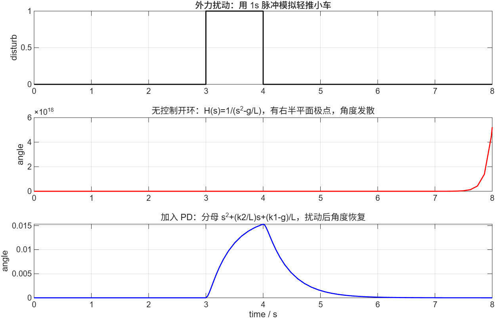
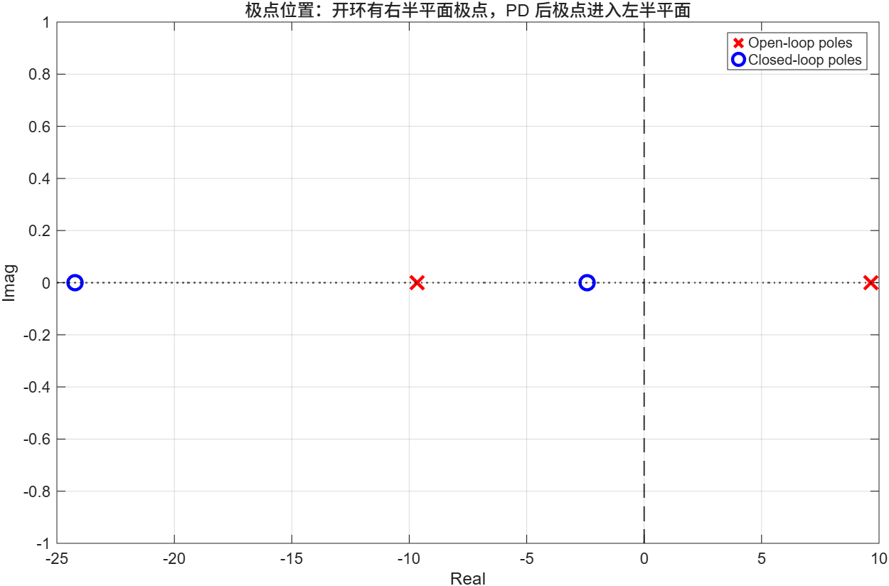

# A43 数学建模与 Simulink 可行性验证

本页记录本项目按照喵呜实验室 A43「数学建模」文章完成的简化倒立摆建模与仿真验证。它的目标不是直接替代实车调参，而是回答一个更基础的问题：

```text
两轮自平衡小车能不能通过角度反馈和角速度反馈在理论上被稳定住？
```

结论是：可以。开环倒立摆存在右半平面极点，天然不稳定；加入角度 P 与角速度 D 反馈后，在满足 `k1 > g`、`k2 > 0` 时，闭环极点进入左半平面，系统具有稳定可行性。

## 文件位置

Simulink 工程位于：

```text
docs/simulink/a43_modeling/
```

主要文件：

- `a43_balance_model_verification.slx`：Simulink 模型文件
- `a43_params.m`：建模参数
- `build_a43_simulink_model.m`：自动生成模型脚本
- `run_a43_verification.m`：一键运行仿真脚本
- `a43_balance_model_verification_result.png`：扰动响应结果图
- `a43_pole_map.png`：极点位置图

## 建模依据

A43 文章将两轮自平衡小车简化为高度为 `L`、质量为 `m` 的倒立摆。开环传递函数核心形式为：

```text
H(s) = 1 / (s^2 - g/L)
```

其极点为：

```text
s = ±sqrt(g/L)
```

由于存在一个正实部极点，开环系统位于右半平面，因此小车在无控制情况下受到扰动后会发散，也就是现实中的“越倒越快”。

加入角度和角速度反馈后，闭环分母变为：

```text
s^2 + (k2/L)s + (k1-g)/L
```

其中：

- `k1` 对应角度反馈，工程代码中近似对应 `g_fAngle_P`
- `k2` 对应角速度反馈，工程代码中近似对应 `g_fAngle_D`

当满足：

```text
k1 > g
k2 > 0
```

闭环极点可以移动到左半平面，系统从理论上变为稳定。

## 仿真链条

本工程中的 Simulink 链路为：

```text
PushStart + PushEnd
        ↓
PulseDisturbance
        ↓
OpenLoop H(s)=1/(s^2-g/L)
ClosedLoop PD
        ↓
open_angle / closed_angle
        ↓
Scope / To Workspace
```

`PushStart` 和 `PushEnd` 两个 Step 模块相减，构造出一个 3s 到 4s 之间的 1 秒脉冲，用来模拟现实中轻推小车造成的外力扰动。

同一个扰动被送入两个模型：

- `OpenLoop`：无控制倒立摆，角度发散
- `ClosedLoop_PD`：加入 PD 反馈后的闭环模型，角度恢复

这样可以直接对比“无控制”和“有角度 PD 控制”两种情况下的响应差异。

## 仿真结果

扰动响应结果：



极点位置图：



本次参数：

```text
g = 9.81 m/s^2
L = 0.105 m
k1 = 16.0
k2 = 2.8
```

计算得到：

```text
开环极点：
+9.6658
-9.6658

闭环极点：
-24.2340
-2.4326
```

开环有一个正实部极点 `+9.6658`，所以角度发散；闭环两个极点都为负实数，所以扰动后角度可以恢复。

## 和 STM32 代码的对应关系

理论模型中的 PD 控制对应固件中的角度环函数：

```c
void AngleControl(void)
{
    g_fAngleControlOut = (0.0f - g_fCarAngle) * g_fAngle_P
                       + (CAR_ANGLE_SPEED_SET - g_fGyroAngleSpeed) * g_fAngle_D;
}
```

对应关系：

| 理论量 | 固件变量 | 含义 |
|---|---|---|
| 车身倾角 `theta` | `g_fCarAngle` | 小车当前歪了多少 |
| 角速度 `theta'` | `g_fGyroAngleSpeed` | 小车当前倒得多快 |
| `k1` | `g_fAngle_P` | 角度反馈强度 |
| `k2` | `g_fAngle_D` | 角速度阻尼强度 |
| 控制输出 | `g_fAngleControlOut` | 最终参与电机 PWM 合成的角度环输出 |

因此，A43 仿真是在验证固件中角度环 PD 控制的理论依据。

## 可行性结论

本仿真可以证明：

```text
两轮自平衡小车不是无解系统；
在倒立摆简化模型下，角度反馈提供回复力，角速度反馈提供阻尼；
当反馈参数满足稳定条件时，系统可以从开环发散变为闭环收敛。
```

它不能直接证明：

- 实车参数已经最优
- 电池低电压时仍能稳定
- 电机方向、编码器方向、机械零点全部正确
- 速度环和角度环一定不会互相影响

这些仍然需要通过真实小车测试、地面站数据记录和参数整定来验证。

## 报告可用表述

可以在项目报告中这样描述：

```text
根据 A43 数学建模，将两轮自平衡小车近似为安装在可移动轮轴上的倒立摆系统。开环传递函数为 H(s)=1/(s^2-g/L)，其极点为 ±sqrt(g/L)，存在右半平面极点，因此系统天然不稳定。引入角度和角速度反馈后，闭环分母变为 s^2+(k2/L)s+(k1-g)/L。当 k1>g 且 k2>0 时，闭环极点进入左半平面。Simulink 仿真结果显示，开环系统在扰动后角度发散，而加入 PD 控制后角度能够恢复，说明角度 PD 控制具有理论可行性。
```
